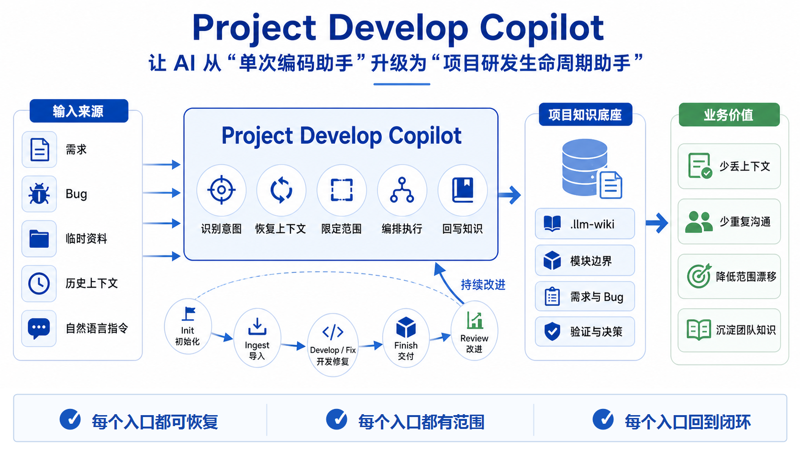

# Project Develop Copilot



Project Develop Copilot 是面向真实项目开发的 skill 集合。它有两个核心目标：

1. 桥接各个顶级 skills 和 tools，纳入统一项目生命周期。
2. 内化项目级 LLM Wiki，作为共享上下文记忆层。

它把项目 LLM Wiki 维护、受控上下文恢复、跨项目引用取证、需求开发、bug 修复、完成同步和交付前评审组合成一条连贯的开发生命周期。

它不替代 Superpowers 类 skills，而是先准备项目上下文、active scopes 和 `.llm-wiki` 状态，再在这个受控上下文里桥接 brainstorming、planning、TDD、debugging、execution、verification 和 review。

它也可以桥接 OpenSpec 风格需求机制、已有 codegraph 上下文，以及 Obsidian LLM Wiki 思想，但这些都是桥接对象，不是硬依赖。旧版 project-coding-skills 是前身，它已经验证过的项目开发思想应内化到这里；当前集合是升级版。见 `references/tool-bridge.md`。

当目标、边界或实现取舍不清楚时，以 `references/north-star.md` 作为对齐来源。

完整生命周期实现计划见 `references/full-lifecycle-implementation-plan.zh.md`；当前能力缺口见 `references/capability-gap-audit.md`。

生命周期验收场景见 `references/acceptance-cases.md`。

团队内部试用手册见 `USER-GUIDE.zh.md`，其中区分“最小使用集”和“全量使用”。

面向领导层的简版设计说明见 `LEADERSHIP-DESIGN.zh.md`。

[English](./README.md) | 简体中文

## Skills

| Skill | 使用场景 |
|---|---|
| `project-develop-copilot` | 将自然语言项目开发意图路由到轻量回答或完整项目生命周期。 |
| `project-query` | 查询项目 `.llm-wiki`，回答项目里有什么、模块或 API 如何调用、哪些 cross-refs 指向外部契约，以及哪些需求、bug、source proxy、artifact 或讨论上下文与主题相关，不默认进入实现。 |
| `project-maintain` | 体检、审计、修复和维护项目 `.llm-wiki` 的可见性、Flow Record、cross-refs、artifact registry、dashboard 一致性、模块回链、日志、链接、安全边界和 doctor 发现。 |
| `project-base-init` | 初始化或刷新独立 Base Graph 仓库，用来协调多个项目本地 `.llm-wiki`，但不把 Base 仓库当成业务项目。 |
| `project-graph-candidates-scan` | 扫描当前项目的 Project Graph 关系候选；只写 candidates 和 scan report，不写 confirmed edge 或 cross-ref pin。 |
| `project-graph-auto-edge` | 通过 Base Graph 和本地/远端源码证据，把 candidate 转成可人工确认的 edge proposal。 |
| `project-graph-human-edge` | 接受、拒绝或手动登记 Project Graph edge，并在写入 confirmed edge 时维护 `cross-refs/index.md` pin。 |
| `project-init` | 初始化或刷新项目 LLM Wiki，发现模块，并迁移旧版 `docs/ai-coding`。 |
| `project-ingest` | 将 PRD、链接、Markdown、PDF、Word、日志、会议纪要或临时资料摄入项目 LLM Wiki。 |
| `project-session-extract` | 将历史 AI/team chat、transcript、旧会话或 handoff 先提取成可召回的 Session Digest；只有用户明确确认后，才把选中内容升级到需求、Bug、Flow Record 或 dashboard。 |
| `project-develop` | 基于受控项目上下文和需求摘要开发需求或功能；当需求依赖跨项目契约时，在 Change Brief 中记录外部依赖和验证状态。 |
| `project-fix` | 基于受控上下文、证据、验证和 bug 摘要诊断并修复项目问题；当 bug 涉及外部服务时，在 Bug Brief 中记录 External Findings。 |
| `project-finish` | 在验证后同步实际变更到 LLM Wiki，在可用时执行 doctor finish check，并准备交付说明。 |
| `project-review` | 检查项目变更的代码风险、测试缺口、范围漂移、过期上下文和 wiki 同步。 |

## 安装

安装顶层 router skill：

```bash
npx skills add huajiexiewenfeng/role-copilot-skills/project-agent-copilot/project-develop-copilot
```

本地开发时，在仓库根目录列出所有可用 skills：

```bash
npx skills add . --list
```

子阶段 skills 仍然可以直接安装用于窄范围测试，但正常面向用户的入口是 project-develop-copilot。

## 生命周期

```text
project-develop-copilot
-> lightweight-answer

或

project-develop-copilot
-> project-query / project-maintain / project-base-init / project-init / project-ingest
-> project-develop 或 project-fix
-> project-finish
-> project-review
```

`project-develop-copilot` 是自然入口路由器。`project-query` 负责只读项目 wiki 查询、cross-project lookup 和讨论上下文组装。`project-maintain` 负责项目 `.llm-wiki` 健康检查、可见性审计、cross-refs 巡检、结构性修复、dashboard 一致性、artifact registry、模块回链、日志、链接和安全检查。`project-init` 和 `project-ingest` 负责完善项目上下文。`project-develop` 和 `project-fix` 在受控上下文内进入实际开发，并在跨项目契约影响需求或 bug 时记录外部依赖 / 外部发现。`project-finish` 将验证后的结果同步回 wiki。`project-review` 在交付前检查代码、测试、范围和上下文一致性。

Superpowers 类 skills 应在项目上下文恢复之后调用，而不是在它之前调用。见 `references/superpowers-bridge.md`。

其他顶级工具也遵循同样的 context-first 桥接规则。见 `references/tool-bridge.md`。

## LLM Wiki Doctor 与校验器

安装这个集合会同时带上 `scripts/llm_wiki_doctor.py`、`scripts/tests/test_llm_wiki_doctor.py` 和 `scripts/git-hooks/pre-commit-llm-wiki-doctor`。doctor 设计为复制或 vendoring 到项目的 `.llm-wiki/tools/` 目录，然后在本地 pre-commit、CI/PR 检查和 `project-finish` 中复用。

当前 validator 聚焦机器能稳定检查的卫生问题：

- `orphan-design-doc`：`.llm-wiki` 外部的 design、requirement、bug 或 plan 文档，应登记为 source，或显式 ignore。
- `missing-graph-evidence`：文档正文提到已知 project-id 且涉及跨项目推理时，应带 Project Graph Evidence / Gaps block。
- `unresolved-project-id`：project-id 只匹配 registry 中配置的逻辑名和 alias，采用词边界风格匹配，并保持 warning 级别。

推荐落地策略是：本地 pre-commit 和 CI 对结构性 P0 问题阻断；判断性更强的 graph evidence 检查长期保持 WARN，除非某个项目主动收紧。命令、配置和 hook 示例见 `scripts/README.llm-wiki-doctor.md`。

## 历史 session 提纯

如果同事已经和 AI 聊过很久，不需要重新开一个 session 从头讲。

可以直接说：

```text
把这段历史 session 提取成项目上下文，先给我看候选导入内容。
```

Project Develop Copilot 会先输出简要候选清单，让用户选择要保留的条目，再整理成 Session Digest Markdown 草稿。用户确认后才写入 `.llm-wiki/session-digests/`。默认不会更新需求、Bug、Flow Record、dashboard、scope 或项目事实；只有用户明确要求 Lifecycle Promotion 时，才把选中内容升级到生命周期对象。

## 只读项目查询

当用户只是想基于项目 `.llm-wiki` 讨论问题，而不是立即开发、修 bug 或更新状态时，使用 `project-query`。典型说法包括：

```text
基于这个项目的 llm wiki，帮我找一下支付回调相关的需求、开发文档和之前的讨论上下文。先不要开发，我们先讨论。
找一下通知重试相关的需求文档、bug 记录和之前的决策。
这个模块在项目 wiki 里有哪些风险和历史背景？
这个功能有哪些 API 或集成点，应该如何调用？
这个项目里面，大疆 API 适配，直播相关的内容有哪些？如何通过 API 调用
```

对于“这个项目里有什么”或“这个 API 怎么调用”这类问题，`project-query` 应先恢复 `.llm-wiki` 证据，再只在需要时检查源码，以核对当前 endpoint、topic、服务行为或示例。除非用户明确要求修改、修复或评审代码，否则不要把这类问题直接路由到实现、调试或 review。

预期输出是 Project Context Pack：

- Answer
- 相关 requirements、bugs、source proxies、artifacts 和 working-context 页面
- 证据和推断分开
- 置信度，以及缺失或过期的上下文
- 可能的下一步路由，例如补充 ingest、创建 Change Brief、创建 Bug Brief、进入 review，或触发 Lifecycle Quality Review

`project-query` 不等同于 `lightweight-answer`：它会主动搜索项目 `.llm-wiki` 并组装证据。它也不等同于完整 lifecycle：除非用户明确要求继续开发、修复、摄入、评审或做 skill 进化，否则它保持只读。

## Project Graph 与跨项目引用层

Project Graph 是 `.llm-wiki` 内的横切证据生命周期，现在拆成三个显式维护子 skill。`project-init` 为业务项目创建 `project-graph/edges.md`、`project-graph/candidates.md`、`project-graph/proposals.md`、`project-graph/scan-report.md` 和只做 pin 的 `cross-refs/index.md`；`project-base-init` 只创建独立 Base Graph 的 catalog / overview 协调结构；`project-query` 按 pin -> edge -> candidate/proposal 回答“这个接口 / topic / Feign 对面是谁”这类只读问题；`project-develop` 在 Change Brief 中记录经过源码验证的外部依赖；`project-fix` 在 Bug Brief 中记录 External Findings；`project-maintain` 负责图谱一致性巡检和结构修复。

Project Graph 维护技能：

- `project-graph-candidates-scan`：扫描当前项目并维护 candidates。
- `project-graph-auto-edge`：通过 Base Graph / 源码证据把 candidate 转成 proposal。
- `project-graph-human-edge`：接受、拒绝或手动登记 confirmed edge，并维护 cross-ref pin。

事实只在人工确认后存于 `project-graph/edges.md`。`cross-refs/index.md` 只是 pin 层，只引用 `edge_id`；本机路径只放在 gitignore 的 registry 文件里。外部项目 wiki 和源码默认 read-only。

### Project Graph 快速入口

- 问“这个接口 / topic / 配置 / 回调对面是谁”：走 `project-query`，按 pin -> edge -> candidate 查询，并在需要时只读读取外部证据。
- 说“帮我登记这个跨项目调用”或“确认这个 proposal”：走 `project-graph-human-edge`，写入 `edges.md` 并默认 upsert `cross-refs/index.md`。
- 说“做一次 project-graph candidates.md 的扫描”：走 `project-graph-candidates-scan`。
- 说“通过 base-graph 找到对应项目，生成 edge proposal”：走 `project-graph-auto-edge`。
- 说“确认这个 proposal / 手动登记这条边”：走 `project-graph-human-edge`。
- 说“初始化这个 Base Graph 仓库”：走 `project-base-init`；普通业务项目仓库才走 `project-init`。
- Base Graph 是可选全局视角，通过 `LLM_WIKI_BASE_GRAPH_PATH` 或 `~/.llm-wiki/base-graph.local.json` 发现。
- Base Graph 的 `registry.local.json` 是本机配置例外；业务项目会话经确认可写它，但不得写 Base 的 `overview.md`、`project-catalog.md`、`decisions/` 或 `handoff/`。
- `~/.llm-wiki/registry.json` 只做 legacy 只读兼容；新实现不创建、不优先写入。

## 上下文模型

共享项目上下文层是 `.llm-wiki`：

```text
.llm-wiki/
  index.md
  log.md
  AGENTS.md
  ingest/
  sources/
  requirements/
  bugs/
  working-context/
  modules/
  artifacts/
  cross-refs/
  project-graph/
  dashboard/
  handoff/
  session-digests/
  migration/
  registry.local.json   (gitignored, local paths only)
```

这个 wiki 是 LLM Wiki 思想在项目开发中的内化子集：它是索引和摘要层，不替代源码、PRD、issue、设计文档、测试或代码。它记录重要资料在哪里、含义是什么、关联哪个模块或需求，以及还存在哪些缺口。

`modules/<scope>/` 保存单个模块、微服务或业务域的长期上下文。`working-context/<change-id>.md` 保存一次需求、Bug 或跨模块变更的任务上下文，用来把 active scopes、read-only scopes、excluded scopes、契约、范围升级和验证计划放在同一个工作闭环里。

旧版 `docs/ai-coding/` 目录视为迁移来源。新的项目上下文应写入 `.llm-wiki`。

## 术语表

| 术语 | 一句话说明 | 主要文件 | 近似概念 |
|---|---|---|---|
| Change Brief / Bug Brief | 由 agent 维护的需求或 bug 生命周期页面。 | `requirements/`、`bugs/`、`references/change-brief.md`、`references/bug-brief.md` | mini-RFC / bug report |
| Flow Record | 一个交付项的证据化生命周期状态行。 | `references/flow-record.md` | 生命周期状态 + 证据索引 |
| Session Digest | 历史会话上下文的确认摘要；默认只作召回上下文。 | `session-digests/`、`references/session-digest.md` | 会话纪要 |
| Scoped Working Context | 复杂或跨模块工作中的 active/read-only/candidate/excluded 上下文。 | `working-context/`、`references/scoped-working-context.md` | monorepo sparse context |
| Lifecycle Gate | 生命周期关键动作前的轻量准入检查。 | `references/lifecycle-gates.md` | readiness checklist |
| Project Graph edge | 跨项目关系事实，可以是 draft 或已验证。 | `project-graph/edges.md`、`references/project-graph.md` | service dependency edge |
| candidate | 尚未验证成事实的疑似跨项目关系。 | `project-graph/candidates.md` | discovery finding |
| proposal | candidate 成为 confirmed edge 之前的人工审查队列项。 | `project-graph/proposals.md` | auto-edge review item |
| pin | 团队导航书签，只引用 `edge_id`，不存事实。 | `cross-refs/index.md` | curated link |
| fingerprint | 用于关系去重的稳定键。 | `references/project-graph.md` | relationship identity key |
| verification_status / derived staleness | edge 的验证级别；是否过期由 `last_verified` 派生。 | `project-graph/edges.md`、`references/cross-project-refs.md` | contract confidence / freshness |
| registry.local.json | 本机项目路径映射文件，必须 gitignore。 | `.llm-wiki/registry.local.json` | local workspace mapping |
| cross-project boundary check | 在 Context Recovery / External Bridge 规则下执行的只读远程证据检查。 | `references/cross-project-refs.md` | remote evidence access guard |
| Base Graph | 可选的机器级 registry 主册与架构 overview/catalog。 | `references/base-graph.md` | platform graph overview |

## 安全边界

- 源码、测试、配置、构建文件和用户决策是事实来源。
- `.llm-wiki` 只保存索引、摘要、关系、状态和缺口，不保存大段原始内容。
- 不默认把 monorepo 里的所有服务都拉进上下文。
- 使用 scoped working context 区分 active、candidate、read-only 和 excluded 模块。
- 除非用户明确要求，不更新旧版 `docs/ai-coding/`。
- 在上下文恢复或需求讨论阶段，不修改代码；只有用户确认实现后才进入代码修改。

## 示例

```text
基于这个项目的 llm wiki，帮我找一下支付回调相关的需求、开发文档和之前的讨论上下文。先不要开发，我们先讨论。
```

```text
Use project init for this repository and migrate legacy docs/ai-coding into .llm-wiki.
```

```text
Use project ingest for docs/prd/new-payment-flow.md.
```

```text
Use project develop for the payment callback requirement. It should only touch order-service and payment-service.
```

```text
Use project fix with this log file and diagnose the suspected notification-service bug.
```
