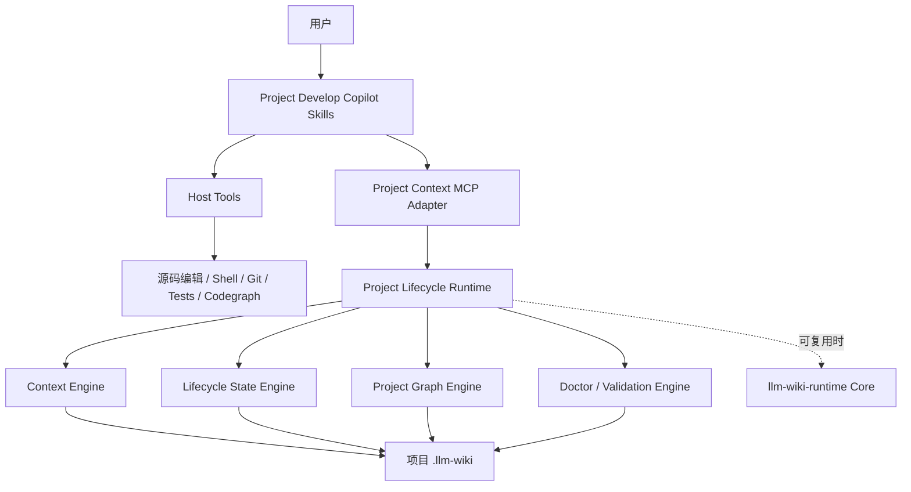

# Project Develop Copilot MCP / Runtime 架构评估

日期：2026-07-30
状态：讨论稿，尚未实施
评估基线：`role-copilot-skills@0f31e1dd42fe6936e247e3fbfbc88f618e94d852`
范围：评估 `project-develop-copilot` 是否需要向 MCP 方向演进，以及 Skill、Runtime、MCP 和 Host 工具之间应如何划分职责。

## 1. 执行结论

`project-develop-copilot` 有必要开始设计 MCP / Runtime 边界，但不应该把整个 Skill 系统改造成 MCP，也不应该立即全面迁移。

推荐方向是：

> Skill 保留语义判断、生命周期路由和项目领导能力；Runtime 接管确定性的项目状态访问与生命周期约束；MCP 只作为 Agent 面向 Runtime 的可插拔适配层。

当前最值得解决的不是“有没有 MCP”，而是 `.llm-wiki` 的初始化、查询、Flow Record 更新、Artifact Registry、Dashboard、Log、Handoff 和 Project Graph 等机械状态操作，仍然主要依赖 LLM 阅读自然语言规则后临时编排。

因此，正确顺序不是：

```text
把 16 个 Skill 映射成 16 个 MCP tools
```

而是：

```text
先抽取 Project Lifecycle Runtime
  -> 再提供少量工作流级 MCP 能力
  -> Skill 继续负责语义控制
  -> CLI / 脚本保留为 CI、测试和 fallback
```

## 2. 评估目标

本次评估回答五个问题：

1. 当前 Skill 是否承担了过多确定性执行职责？
2. 哪些职责必须继续由 LLM / Skill 掌握？
3. 哪些职责适合下沉到 Runtime？
4. MCP 是否能带来净收益，而不是新的工具噪声？
5. 应该如何渐进演进，避免破坏项目最有价值的生命周期设计？

## 3. 当前系统概况

在评估基线上，`project-develop-copilot` 包含 16 个 `SKILL.md`：

- 根 Router；
- `project-base-init`；
- `project-init`；
- `project-ingest`；
- `project-query`；
- `project-develop`；
- `project-fix`；
- `project-finish`；
- `project-review`；
- `project-maintain`；
- `project-session-extract`；
- `llm-wiki-doctor`；
- 三个 Project Graph 写入 Skill；
- `project-graph-visualize`。

这些 Skill 合计约：

```text
4,073 行
207,475 字符
全部加载时约 64,836 tokens（粗略估算）
```

实际运行使用渐进式读取，不会一次加载全部内容；但根 Router、一个主要子 Skill 和若干深层 references 组合后，仍可能占用数千到上万 token。

体积本身不是错误。真正的问题是其中相当一部分内容不是项目语义，而是：

- 文件路径和目录规则；
- 初始化结构；
- 多文件更新顺序；
- Registry、Dashboard 和 Log 的一致性规则；
- CLI 命令与参数；
- 状态值校验；
- 重试和失败边界；
- 跨项目路径解析；
- 结构化输出格式。

这些规则如果每次都由 LLM 重新理解和执行，会带来重复成本和行为漂移。

## 4. 当前架构已经做对的事情

### 4.1 Router 只负责路由和生命周期连续性

根 Router 已经明确区分：

- `lightweight-answer`；
- `full-lifecycle`；
- `mechanical-artifact`；
- Wiki-backed query；
- develop、fix、finish、review、maintain；
- 外部 Skill Bridge。

它也明确拥有 Initialization Gate、Lifecycle Anchor Gate、External Bridge Gate、Finish Sync Gate 等跨阶段责任。

这些是系统的核心价值，不应该被 Runtime 或 MCP 替代。

### 4.2 `.llm-wiki` 有清晰的事实权威顺序

当前设计已经定义：

```text
当前用户决策
  -> 当前源码、测试和验证输出
  -> Flow Record
  -> Artifact Registry
  -> Log
  -> Dashboard / Handoff
  -> 未晋升的 Session Digest
```

尤其重要的是：

- Flow Record 是生命周期状态权威；
- Artifact Registry 是产物存在与可发现性权威；
- Dashboard 是投影，不是事实源；
- Log 是审计记录，不是状态权威；
- Session Digest 默认只是召回上下文。

这套模型非常适合进一步固化为 Runtime invariant。

### 4.3 已经存在确定性执行能力

项目并非完全依赖自然语言执行，已经存在两个确定性能力岛：

1. `llm_wiki_doctor.py`
   - validate；
   - score；
   - report；
   - Git 证据检查；
   - Project Graph 和知识反腐化校验；
   - 结构化 JSON 输出。

2. Project Graph Visualizer
   - PowerShell builder；
   - validator；
   - HTML snapshot；
   - 本地路径泄漏检查；
   - 确定性机械产物模式。

这证明项目已经自然走向“Skill 负责语义，代码负责确定性执行”，只是尚未形成统一 Runtime。

### 4.4 写入边界已经比较严格

当前 Skill 明确限制：

- 自动最小初始化只能写 `.llm-wiki/**`；
- 普通 query 不得修改生命周期状态；
- 跨项目读取默认只读；
- 业务项目会话不得写 Base Graph tracked files；
- 只有确认后的路径映射可以进入本地 Registry；
- finish 不能在没有验证证据时标记完成；
- graph candidate 不能被静默提升为 confirmed edge。

这些规则应该保留，并尽量变成 Runtime 的结构化权限和状态转换校验。

## 5. 当前隐含耦合

### 5.1 初始化由 LLM 执行大量文件操作

`project-init` 当前要求 Agent：

- 解析项目根目录；
- 检查多种 root evidence；
- 创建标准 `.llm-wiki` 目录；
- 创建 starter 文件；
- 复制 Doctor scaffold；
- 初始化 module index；
- 生成 Dashboard；
- 更新 Artifact Registry；
- 写入 Log；
- 计算 initialization level；
- 返回 pending route。

其中“项目根是否正确”“选择哪些 scope”需要 LLM 判断，但目录创建、模板版本、幂等写入、结构迁移和 initialization level 计算更适合 Runtime。

### 5.2 查询由 LLM 手动遍历多个索引

`project-query` 当前需要按顺序处理：

```text
Wiki entrypoints
  -> module / ingest / artifact indexes
  -> cross-ref pin
  -> confirmed edge
  -> candidate
  -> registry
  -> remote project
  -> source fallback
```

LLM 还必须控制：

- 最大读取范围；
- remote read-only 边界；
- candidate-only 与 verified evidence 的区别；
- stale evidence 降级；
- Project Context Pack 格式；
- context refs。

LLM 应决定“查什么、是否需要远端证据”，但路径遍历、访问策略、结果裁剪和引用组装应由 Runtime 提供。

### 5.3 生命周期状态需要跨文件同步

一次 `project-finish` 可能依次更新：

```text
Flow Record
  -> Requirement / Bug / Working Context
  -> Artifact Registry
  -> Dashboard
  -> Handoff
  -> Log
  -> Doctor validation
```

当前规则要求“先更新 Flow Record，再生成投影”，但这个顺序仍由 LLM 执行。

主要风险包括：

- Flow Record 已更新，Dashboard 未更新；
- Artifact 已存在，但 Registry 没有登记；
- Dashboard 宣称完成，Flow Record 仍是 active；
- Handoff 声明验证通过，但没有原始验证证据；
- 多文件操作中途失败后，LLM 错误地宣称整体成功。

这类问题适合用 Runtime transaction、幂等键、步骤结果和恢复语义解决。

### 5.4 维护规则过多地停留在自然语言

`project-maintain` 包含大量可以确定判断的规则：

- dangling `edge_id`；
- duplicate fingerprint；
- 非法 absolute path；
- Registry 被 Git 跟踪；
- pin/edge/candidate 不一致；
- Dashboard card 与 Flow Record 不一致；
- Artifact Registry 路径漂移；
- 缺少 module backlink；
- stale candidate；
- 不支持的 verification status。

Doctor 已覆盖其中一部分，但其他检查和 repair 仍主要由 Agent 阅读规则后执行。

### 5.5 CLI 和平台差异进入 Skill

当前 Doctor 和 Visualizer 要求 Skill 记住：

- Python 解释器；
- Doctor 文件发现顺序；
- CLI 子命令；
- 参数组合；
- stdout / JSON；
- exit code；
- PowerShell 路径；
- `ExecutionPolicy Bypass`；
- Windows 路径和引号转义。

这些都不属于项目开发语义。

## 6. 责任边界判断

### 6.1 必须保留在 Skill / LLM 的职责

| 职责 | 原因 |
| --- | --- |
| 判断 lightweight-answer 或 full-lifecycle | 依赖用户真实意图 |
| 选择 develop、fix、review、finish 等路由 | 属于项目生命周期语义 |
| 识别项目范围和业务目标 | 需要上下文理解 |
| 判断什么属于事实、推断、风险或候选 | 需要综合证据 |
| 决定创建、复用或拆分 Change Brief | 涉及交付边界 |
| 判断哪些结果值得沉淀 | 不能由存储层替代 |
| 需求讨论和架构权衡 | 是 Copilot 的核心智能 |
| 代码实现、调试和 Review | 需要 Host 工具与源代码推理 |
| 选择 brainstorming、TDD、codegraph 等 Bridge | 属于动态能力编排 |
| 处理模糊信息和用户确认 | 不能硬编码成机械状态机 |
| 判断验证是否满足业务目标 | Runtime 只能校验结构和证据存在性 |

### 6.2 应下沉到 Runtime 的职责

| 职责 | Runtime 应提供的保证 |
| --- | --- |
| Project Root / Wiki Root 解析 | 路径边界、证据和置信度结构 |
| Wiki 初始化 | 版本化模板、幂等、迁移、错误恢复 |
| 有界 Context Pack | allowlist、预算、顺序、引用 |
| Flow Record CRUD | 唯一标识、状态转换、证据前置条件 |
| Artifact Registry | 唯一性、路径、owner 和 backlink |
| Dashboard 投影 | 只从 Flow Record 与 Artifact 生成 |
| Log 追加 | append-only、时间和事件 ID |
| Handoff 生成 | 从权威状态生成，不反向覆盖状态 |
| Doctor 调用 | 解释器发现、参数、JSON、exit code |
| Project Graph 查询 | pin、edge、candidate、registry 顺序 |
| Graph 写入 | proposal、确认、fingerprint、权限 |
| 跨项目访问 | read-only scope、路径 containment |
| 多文件提交 | preview、commit、幂等、部分失败和恢复 |

### 6.3 MCP 只负责协议适配

MCP Adapter 应负责：

- 暴露类型化 tool schema；
- 接收 Host 调用；
- 绑定允许访问的项目根；
- 将 Runtime 结果转换成稳定响应；
- 提供权限、超时、取消和观测信息；
- 隔离平台差异。

MCP 不应：

- 判断用户当前是不是要开发；
- 自动把所有 Wiki 内容注入 prompt；
- 决定什么业务信息值得写入；
- 替代 Router；
- 替代源码编辑、测试或 Git Host 工具；
- 成为新的生命周期权威。

## 7. 推荐目标架构



架构原则：

1. Skill 是智能控制面；
2. Runtime 是确定性状态数据面；
3. MCP 是 Agent 原生适配层；
4. Host Tools 继续负责真实项目开发；
5. `.llm-wiki` 仍是项目本地、可审计、可 Git 管理的数据；
6. CLI / 脚本继续服务人类、CI、pre-commit、测试和 fallback。

## 8. 与 llm-wiki-runtime 的关系

当前 `project-develop-copilot` 没有接入 `llm-wiki-runtime`。两者存在明显重叠，但不能直接假设兼容。

### 8.1 可复用的通用能力

优先评估复用：

- scope 与配置解析；
- 路径边界；
- 原子写入；
- lock；
- append-only log；
- context pack；
- record lookup；
- source provenance；
- 引用校验；
- structured response envelope；
- retry-safe write。

### 8.2 Project Domain 特有能力

需要 Project Lifecycle Domain Adapter：

- Change Brief；
- Bug Brief；
- Flow Record；
- verification evidence；
- Artifact Registry；
- Dashboard projection；
- Handoff；
- Project Graph；
- Base Graph；
- Session Digest promotion；
- lifecycle gates。

### 8.3 推荐组合

不建议复制一个完全独立的存储 Runtime，也不建议强迫通用 Runtime 理解所有项目语义。

推荐：

```text
llm-wiki-runtime Core
  + Project Lifecycle Domain Adapter
  + Project Context MCP Adapter
```

前提是兼容性评估证明现有 `.llm-wiki` 可以渐进迁移，并且不会破坏团队共享 Markdown、Git diff 可读性和当前 Skill contract。

如果兼容成本过高，可以先让 Project Lifecycle Runtime 独立存在，但应复用相同的响应 envelope、路径安全、锁和原子写入模式。

## 9. 推荐 MCP 能力面

不建议按照 Skill 数量或文件操作数量暴露工具。

第一阶段控制在五个工作流级能力。

### 9.1 `project_context.resolve`

用途：

- 解析项目根；
- 检查 Wiki 是否存在；
- 返回初始化级别；
- 返回当前 active / candidate flows；
- 返回可访问 Domain 和跨项目能力；
- 返回降级原因。

默认只读。

### 9.2 `project_context.query`

用途：

- 接收问题、scope、预算和证据要求；
- 查询最小 Wiki entrypoints；
- 执行 pin -> edge -> candidate 导航；
- 需要时解析远端只读项目；
- 返回 bounded context pack；
- 区分 evidence、inference、candidate-only 和 stale clue；
- 返回 `context_refs`。

默认只读，不创建生命周期状态。

### 9.3 `project_lifecycle.preview`

用途：

- 预览 Change Brief / Bug Brief / Flow Record 变更；
- 预览 Artifact、Dashboard、Handoff 和 Log 影响；
- 检查状态转换前置条件；
- 检查重复 flow；
- 返回冲突、风险和确认要求；
- 生成短期 preview token。

不修改持久状态。

### 9.4 `project_lifecycle.commit`

用途：

- 接收 preview token；
- 检查输入和工作区是否漂移；
- 先更新 Flow Record；
- 再更新 Artifact Registry；
- 再生成 Dashboard / Handoff 投影；
- 最后追加 Log；
- 返回每一步结果和最终引用；
- 支持幂等重试和部分失败恢复。

这是第二阶段能力，不应与只读 MCP 原型同时仓促交付。

### 9.5 `project_context.diagnose`

用途：

- 调用 Doctor；
- 检查 Wiki、Flow、Artifact、Dashboard 和 Graph drift；
- 返回结构化 Errors、Warnings、Info；
- 区分 deterministic finding 与 LLM semantic judgment；
- 提供 repair preview，但默认不修复。

### 9.6 后续可选能力

只有在第一阶段证明收益后，再考虑：

- `project_graph.preview_change`；
- `project_graph.commit_change`；
- `project_graph.render`；
- `project_context.migrate`。

不要因为 MCP 可用就扩张工具面。

## 10. 为什么不能一比一暴露全部能力

MCP 本身不天然减少 token。

如果将当前 CLI、子 Skill 和机械动作分别映射为几十个 tools，会产生：

- 工具描述长期占用上下文；
- Tool selection 更困难；
- 参数 schema 重复；
- Agent 仍然需要编排底层步骤；
- 工具版本升级成本增加；
- 原有 Skill 噪声变成 MCP schema 噪声。

新增 MCP tool 必须至少满足一项：

- 减少 LLM 需要理解的执行细节；
- 减少调用轮次；
- 形成独立权限边界；
- 提供原子性或幂等保证；
- 提高可观测性；
- 屏蔽平台差异。

否则不应新增。

## 11. 主要收益

### 11.1 降低上下文负担

Skill 不再需要重复描述：

- 文件查找顺序；
- 目录初始化；
- 多文件同步顺序；
- CLI 参数；
- JSON / path 转义；
- exit code；
- 相同的降级状态。

### 11.2 提高状态一致性

Runtime 可以强制：

- Flow Record 先于 Dashboard；
- verification evidence 先于 testing done；
- Artifact 存在后才能登记；
- confirmed edge 必须通过 proposal / confirmation；
- remote project 默认只读；
- Log 不得成为状态权威。

### 11.3 减少部分成功误报

多文件写入可以返回：

```text
committed
partially_committed
rejected_precondition
conflict
stale_preview
permission_denied
recovery_required
```

Agent 不再仅凭几次文件写入或 CLI exit code 判断整体成功。

### 11.4 降低跨平台耦合

Python、PowerShell、路径、编码和 Shell 转义由 Runtime / Adapter 处理。

### 11.5 改善 Trace 与 Eval

未来可以观测：

- 哪个 Skill 发起了什么意图；
- Runtime 执行了哪些确定性步骤；
- 使用了哪些 context refs；
- 状态为何被拒绝或降级；
- 哪一步出现部分失败；
- 哪些规则最常导致错误或人工介入。

### 11.6 支持多个 Agent Host

Codex、Claude、IDE Agent 或其他支持 MCP 的 Host 可以复用统一能力，而不需要各自实现 CLI 调用与状态写入。

## 12. 主要成本与风险

### 12.1 过早固化协议

`project-develop-copilot` 仍在快速演进。过早冻结 Flow Record、Graph 或 Dashboard schema，可能限制后续设计。

缓解方式：

- 先定义 invariant；
- schema 带版本；
- MCP 接口比存储 schema 更稳定；
- 只读能力先行；
- 写入能力延后。

### 12.2 多一层服务生命周期

需要处理：

- 安装；
- 启动；
- 停止；
- 重连；
- 升级；
- 版本握手；
- 日志；
- Host 配置；
- Runtime 不可用降级。

### 12.3 双接口维护

CLI / scripts 和 MCP 都需要：

- 契约测试；
- 文档；
- 错误模型；
- 版本兼容；
- fallback 验证。

### 12.4 跨项目权限风险

Project MCP 可能访问多个本地仓库。必须：

- Host 绑定允许的 roots；
- 不接受任意未授权绝对路径；
- remote project 默认只读；
- Base tracked files 单独授权；
- Registry 本机路径不得进入团队共享文件；
- 写入前再次检查 containment。

### 12.5 调试链路变长

故障链路可能变成：

```text
Skill
  -> Host
  -> MCP Client
  -> MCP Adapter
  -> Project Runtime
  -> llm-wiki Core
  -> Filesystem / Git
```

必须提供稳定 error code、trace id、version 和 diagnose 能力。

### 12.6 Runtime 变成僵硬工作流引擎

如果 Runtime 接管需求判断、路由和项目语义，会损失 LLM 的适应性，并重复构建一个复杂编排系统。

Runtime 只应验证和执行已经由 Skill 选择的确定性动作。

## 13. 推荐演进阶段

### P0：契约与基线

目标：不写 MCP 代码，先明确边界。

- 定义 Project Runtime invariant；
- 盘点所有 `.llm-wiki` 写入点；
- 定义权威顺序；
- 定义 error taxonomy；
- 定义 context refs；
- 定义版本与兼容策略；
- 统计当前典型任务 token、工具调用次数和漂移问题；
- 建立 Skill-only 行为基线。

### P1：只读 Runtime / MCP

实现：

- `project_context.resolve`；
- `project_context.query`；
- `project_context.diagnose`。

约束：

- 不写 Wiki；
- 不创建 Flow；
- 不修改 Registry；
- 不替代 Router；
- CLI / Skill fallback 保持可用。

### P2：Preview

实现：

- Flow 匹配；
- Change Brief / Bug Brief preview；
- 状态转换校验；
- 多文件影响预览；
- confirmation requirements；
- preview token。

仍不执行写入。

### P3：事务化 Commit

实现：

- Flow Record 更新；
- Artifact Registry 更新；
- Dashboard / Handoff 投影；
- Log append；
- 幂等；
- lock；
- partial failure；
- recovery。

先选择一个低风险 Domain 或 Fixture 灰度。

### P4：Project Graph 与迁移

在前面阶段验证收益后，再处理：

- Graph proposal / confirmation；
- Base Graph；
- Graph render；
- 旧 Wiki schema migration；
- 多 Host 认证。

## 14. 验证指标

是否继续扩大 MCP 化，应由数据决定。

### 14.1 效率

- 根 Skill 和子 Skill 的机械规则是否减少；
- 单任务输入 token 是否下降；
- 工具调用轮次是否下降；
- 新 Domain 接入成本是否下降；
- 平均完成时间是否下降。

### 14.2 正确性

- wrong-root 写入次数；
- Dashboard / Flow drift 次数；
- Artifact 漏登记次数；
- 部分成功误报次数；
- stale evidence 被当成事实的次数；
- remote write boundary 违规次数；
- failed recovery 次数。

### 14.3 可用性

- MCP 启动失败率；
- Host 重连成功率；
- CLI fallback 成功率；
- 不同平台行为一致性；
- 用户确认次数是否合理；
- 普通任务是否被额外流程拖慢。

### 14.4 Token 净收益

必须比较：

```text
减少的 Skill / reference tokens
  - 新增的 MCP schema tokens
  - 新增工具返回 tokens
  - 新增重试与诊断 tokens
```

只看 Skill 变短是不够的。

## 15. 失败模式

出现以下情况时，应暂停扩大 MCP 化：

- MCP tools 数量快速增长；
- Agent 仍需逐步编排底层写入；
- Skill 变短但总 token 上升；
- Runtime 开始判断业务语义；
- CLI 与 MCP 行为不一致；
- MCP 不可用时原工作流无法继续；
- schema 频繁破坏兼容；
- 多仓库权限难以控制；
- Runtime 修改 Markdown 后 Git diff 可读性明显下降；
- 用户为了简单讨论被迫进入重生命周期。

## 16. 非目标

本次方向不包括：

- 用 MCP 替代全部 Skills；
- 用 MCP 替代 Codex 的文件、Shell、Git、测试和代码工具；
- 把 Router 改成固定状态机；
- 自动将全部 `.llm-wiki` 注入 prompt；
- 删除 CLI 和 repo-vendored Doctor；
- 立即统一所有 Project Graph 与 Base Graph 写入；
- 立即迁移所有项目 Wiki；
- 让 Runtime 决定什么业务知识值得保存；
- 让 Dashboard 成为新的事实源。

## 17. 开放问题

正式设计前仍需回答：

1. `llm-wiki-runtime` 的 profile / record model 能否无损表达 Flow Record？
2. Project Runtime 应放在 `llm-wiki-runtime` 仓库，还是作为独立 Domain Adapter？
3. Markdown 仍是唯一持久事实，还是需要本地派生索引？
4. preview token 如何绑定 Git HEAD、worktree dirty state 和 source hash？
5. 多文件 commit 失败后采用补偿、resume 还是显式 partial state？
6. Host 如何绑定允许访问的 project roots？
7. Base Graph 与 business project 的权限是否需要独立 MCP Server？
8. Tool schema 如何保持小而稳定？
9. 当前 Skill-only 方案的真实失败率和 token 基线是多少？
10. Codex、Claude 等 Host 的 MCP 行为差异如何认证？

## 18. 最终判断

`project-develop-copilot` 最有价值的部分是：

- 自然语言路由；
- 生命周期连续性；
- 项目上下文恢复；
- 证据权威顺序；
- 开发、修复、完成和 Review 的完整闭环；
- 与外部专业 Skills 的桥接。

这些能力应该继续留在 Skill。

当前最需要演进的部分是：

- `.llm-wiki` 访问；
- 多文件状态同步；
- Flow Record 状态转换；
- Artifact / Dashboard / Handoff / Log 投影；
- Doctor / Graph 的确定性执行；
- 跨项目访问与权限；
- 幂等、原子性和恢复。

因此，本次评估结论为：

> 有必要向 MCP 演进，但真正需要建设的是 Project Lifecycle Runtime。MCP 是 Runtime 面向 Agent 的适配器，不是项目的核心，也不是 Skill 的替代品。

实施建议是：

> 现在开始边界设计和只读原型；暂不全面迁移；先用数据证明可靠性、token 和维护成本的净收益，再进入事务化写入阶段。
